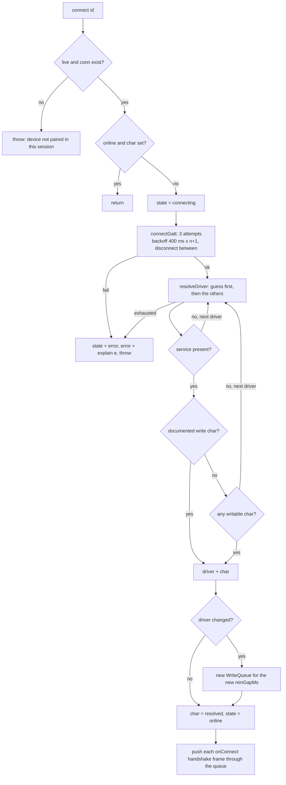
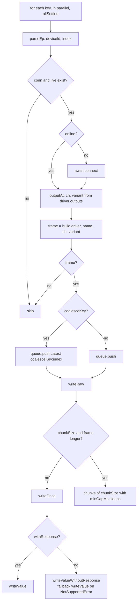
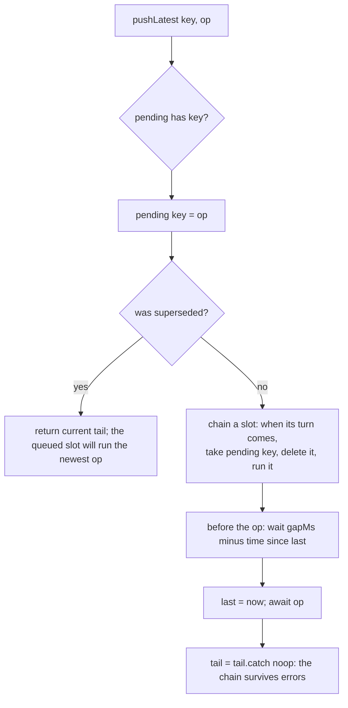
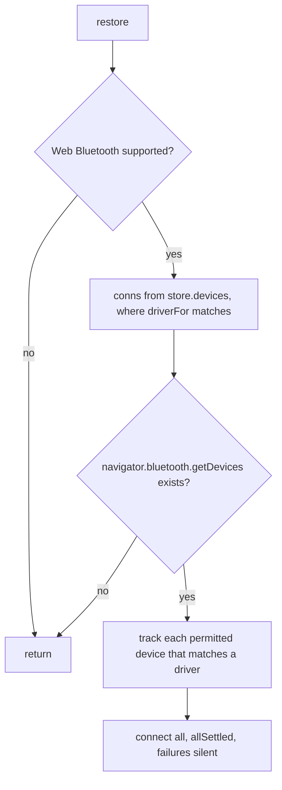

# Flowcharts — ble

## `connect(id)`

```mermaid
flowchart TD
  S[connect id] --> P{live and conn exist?}
  P -- no --> ERR0[throw: device not paired in this session]
  P -- yes --> O{online and char set?} -- yes --> R[return]
  O -- no --> C[state = connecting]
  C --> G[connectGatt: 3 attempts<br/>backoff 400 ms x n+1, disconnect between]
  G -- fail --> E[state = error, error = explain e, throw]
  G -- ok --> RD[resolveDriver: guess first, then the others]
  RD --> SV{service present?}
  SV -- no, next driver --> RD
  SV -- yes --> CH{documented write char?}
  CH -- yes --> OK
  CH -- no --> AW{any writable char?}
  AW -- yes --> OK[driver + char]
  AW -- no, next driver --> RD
  RD -- exhausted --> E
  OK --> D{driver changed?} -- yes --> Q[new WriteQueue for the new minGapMs]
  D -- no --> ON
  Q --> ON[char = resolved, state = online]
  ON --> H[push each onConnect handshake frame through the queue]
```

## `applyTo(keys, build, coalesceKey)`

```mermaid
flowchart TD
  K[for each key, in parallel, allSettled] --> PE[parseEp: deviceId, index]
  PE --> X{conn and live exist?} -- no --> SKIP[skip]
  X -- yes --> ON{online?} -- no --> CN[await connect]
  ON -- yes --> OA
  CN --> OA[outputAt: ch, variant from driver.outputs]
  OA --> B[frame = build driver, name, ch, variant]
  B --> U{frame?} -- no --> SKIP
  U -- yes --> CK{coalesceKey?}
  CK -- yes --> PL[queue.pushLatest coalesceKey:index]
  CK -- no --> PU[queue.push]
  PL --> W[writeRaw]
  PU --> W
  W --> CH{chunkSize and frame longer?}
  CH -- no --> W1[writeOnce]
  CH -- yes --> W2[chunks of chunkSize with minGapMs sleeps]
  W1 --> WR{withResponse?}
  WR -- yes --> WV[writeValue]
  WR -- no --> WN[writeValueWithoutResponse<br/>fallback writeValue on NotSupportedError]
```

## `WriteQueue.pushLatest(key, op)`

```mermaid
flowchart TD
  S[pushLatest key, op] --> H{pending has key?}
  H --> SET[pending key = op]
  SET --> H2{was superseded?}
  H2 -- yes --> RT[return current tail; the queued slot will run the newest op]
  H2 -- no --> CH[chain a slot: when its turn comes,<br/>take pending key, delete it, run it]
  CH --> GAP[before the op: wait gapMs minus time since last]
  GAP --> RUN[last = now; await op]
  RUN --> CATCH[tail = tail.catch noop: the chain survives errors]
```

## `restore()`

```mermaid
flowchart TD
  S[restore] --> SU{Web Bluetooth supported?} -- no --> R[return]
  SU -- yes --> SEED[conns from store.devices, where driverFor matches]
  SEED --> GD{navigator.bluetooth.getDevices exists?} -- no --> R
  GD -- yes --> T[track each permitted device that matches a driver]
  T --> CA[connect all, allSettled, failures silent]
```
