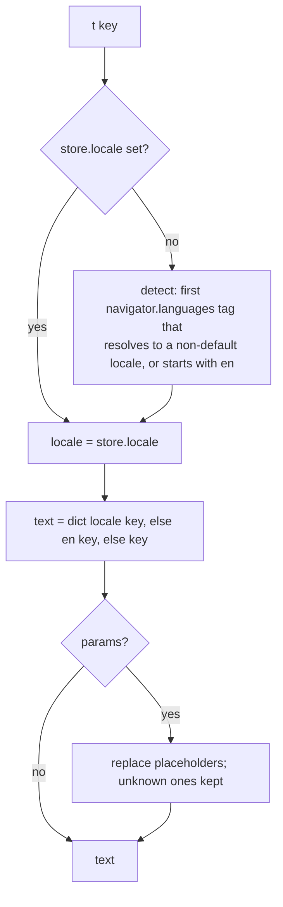
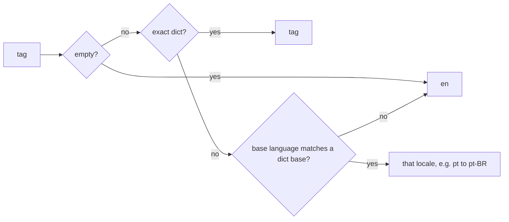

# Flowcharts — i18n

## `t(key, params)`

```mermaid
flowchart TD
  T[t key] --> LC{store.locale set?}
  LC -- yes --> LOC[locale = store.locale]
  LC -- no --> DET[detect: first navigator.languages tag that<br/>resolves to a non-default locale, or starts with en]
  DET --> LOC
  LOC --> TR[text = dict locale key, else en key, else key]
  TR --> P{params?} -- no --> OUT[text]
  P -- yes --> I[replace placeholders; unknown ones kept] --> OUT
```

## `resolveLocale(tag)`

```mermaid
flowchart LR
  A[tag] --> B{empty?} -- yes --> EN[en]
  B -- no --> C{exact dict?} -- yes --> X[tag]
  C -- no --> D{base language matches a dict base?} -- yes --> M[that locale, e.g. pt to pt-BR]
  D -- no --> EN
```
