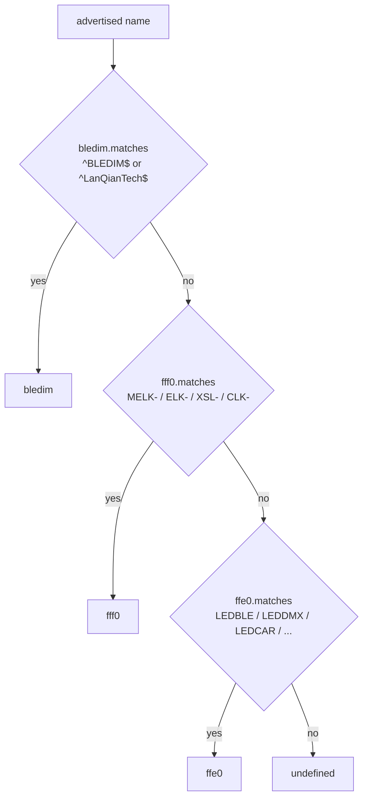
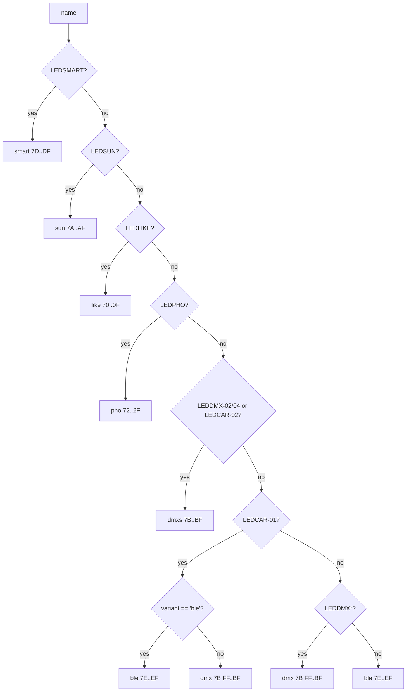
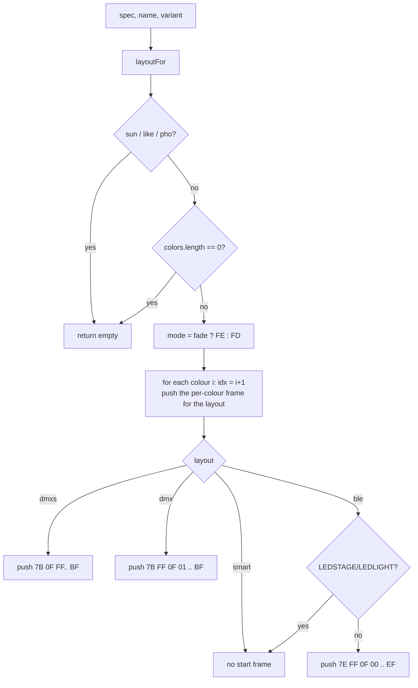
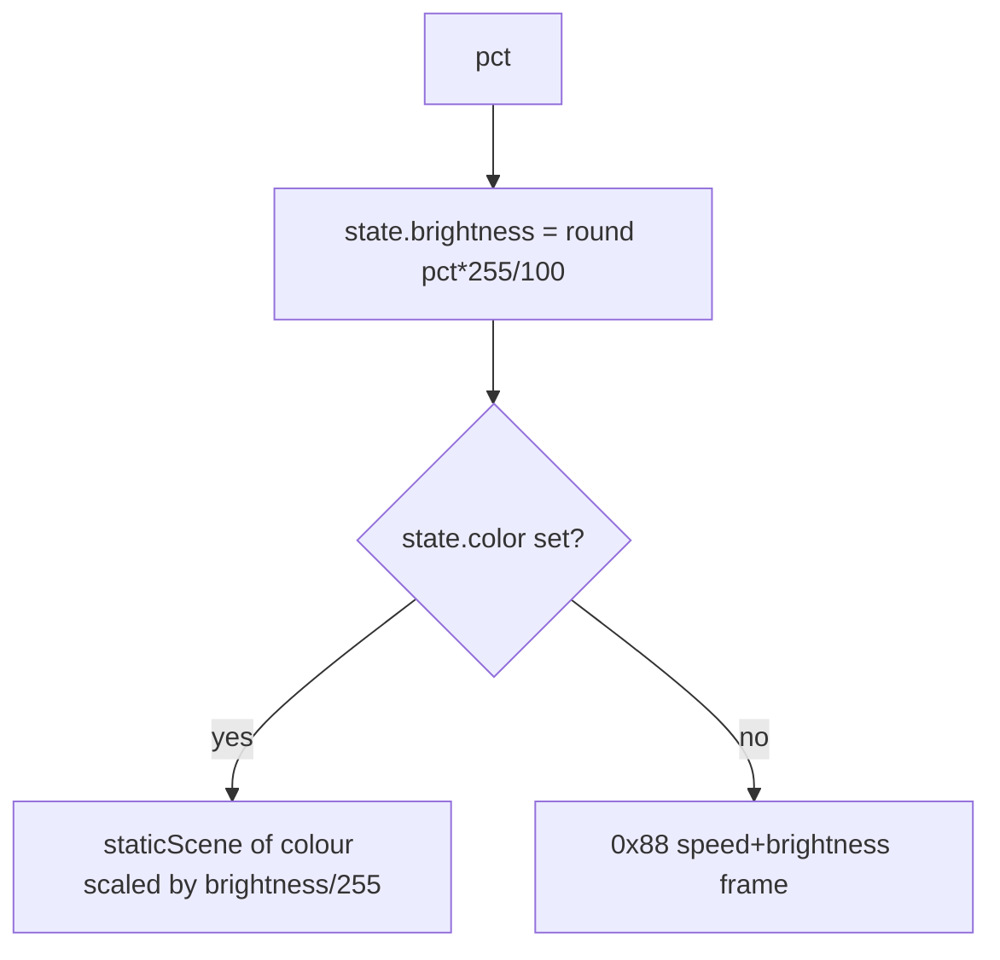
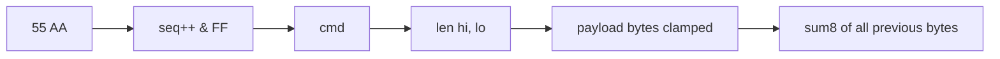

# Flowcharts — protocol

## Driver selection by name (`driverFor`)

```mermaid
flowchart TD
  N[advertised name] --> B{bledim.matches<br/>^BLEDIM$ or ^LanQianTech$}
  B -- yes --> BD[bledim]
  B -- no --> F{fff0.matches<br/>MELK- / ELK- / XSL- / CLK-}
  F -- yes --> FD[fff0]
  F -- no --> E{ffe0.matches<br/>LEDBLE / LEDDMX / LEDCAR / ...}
  E -- yes --> ED[ffe0]
  E -- no --> U[undefined]
```

## ffe0 `layoutFor(name, variant)`

```mermaid
flowchart TD
  S[name] --> A{LEDSMART?} -- yes --> smart[smart 7D..DF]
  A -- no --> B{LEDSUN?} -- yes --> sun[sun 7A..AF]
  B -- no --> C{LEDLIKE?} -- yes --> like[like 70..0F]
  C -- no --> D{LEDPHO?} -- yes --> pho[pho 72..2F]
  D -- no --> E{LEDDMX-02/04 or LEDCAR-02?} -- yes --> dmxs[dmxs 7B..BF]
  E -- no --> F{LEDCAR-01?}
  F -- yes --> V{variant == 'ble'?}
  V -- yes --> ble1[ble 7E..EF]
  V -- no --> dmx1[dmx 7B FF..BF]
  F -- no --> G{LEDDMX*?} -- yes --> dmx[dmx 7B FF..BF]
  G -- no --> ble[ble 7E..EF]
```

## ffe0 `customEffect`

```mermaid
flowchart TD
  S[spec, name, variant] --> L[layoutFor]
  L --> X{sun / like / pho?} -- yes --> E0[return empty]
  X -- no --> Z{colors.length == 0?} -- yes --> E0
  Z -- no --> M[mode = fade ? FE : FD]
  M --> LOOP[for each colour i: idx = i+1<br/>push the per-colour frame for the layout]
  LOOP --> ST{layout}
  ST -- dmxs --> S1[push 7B 0F FF.. BF]
  ST -- dmx --> S2[push 7B FF 0F 01 .. BF]
  ST -- smart --> S3[no start frame]
  ST -- ble --> S4{LEDSTAGE/LEDLIGHT?}
  S4 -- yes --> S3
  S4 -- no --> S5[push 7E FF 0F 00 .. EF]
```

## bledim brightness

```mermaid
flowchart TD
  P[pct] --> C[state.brightness = round pct*255/100]
  C --> Q{state.color set?}
  Q -- yes --> SS[staticScene of colour scaled by brightness/255]
  Q -- no --> SB[0x88 speed+brightness frame]
```

## bledim `frame(cmd, payload)`

```mermaid
flowchart LR
  A[55 AA] --> B[seq++ & FF] --> C[cmd] --> D[len hi, lo] --> E[payload bytes clamped] --> F[sum8 of all previous bytes]
```
