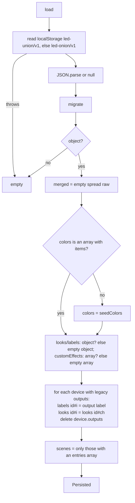
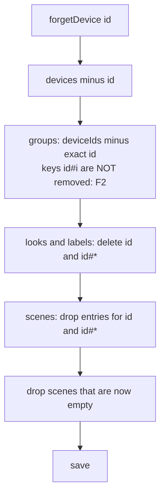

# Flowcharts — store

## `load()` + `migrate(raw)`

```mermaid
flowchart TD
  L[load] --> R[read localStorage led-union/v1, else led-onion/v1]
  R -- throws --> EM[empty]
  R --> P[JSON.parse or null] --> M[migrate]
  M --> O{object?} -- no --> EM
  O -- yes --> MG[merged = empty spread raw]
  MG --> C{colors is an array with items?} -- no --> SC[colors = seedColors]
  C -- yes --> LK
  SC --> LK[looks/labels: object? else empty object; customEffects: array? else empty array]
  LK --> OUT[for each device with legacy outputs:<br/>labels id#i = output label<br/>looks id#i = looks id#ch<br/>delete device.outputs]
  OUT --> SN[scenes = only those with an entries array]
  SN --> RET[Persisted]
```

## `forgetDevice(id)` cascade

```mermaid
flowchart TD
  F[forgetDevice id] --> D[devices minus id]
  D --> G[groups: deviceIds minus exact id<br/>keys id#i are NOT removed: F2]
  G --> LL[looks and labels: delete id and id#*]
  LL --> SE[scenes: drop entries for id and id#*]
  SE --> SE2[drop scenes that are now empty]
  SE2 --> SV[save]
```
