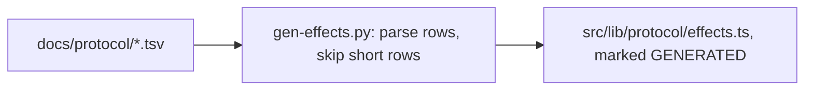
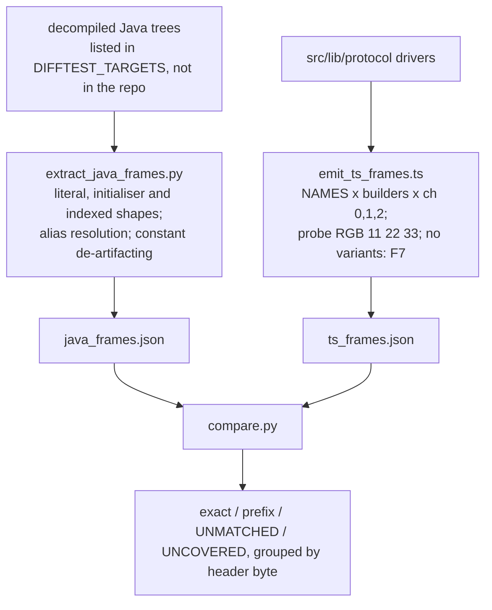

# Flowcharts — tools

## gen-effects

```mermaid
flowchart LR
  T[docs/protocol/*.tsv] --> P[gen-effects.py: parse rows, skip short rows] --> O[src/lib/protocol/effects.ts, marked GENERATED]
```

## difftest

```mermaid
flowchart TD
  J[decompiled Java trees<br/>listed in DIFFTEST_TARGETS, not in the repo] --> X[extract_java_frames.py<br/>literal, initialiser and indexed shapes;<br/>alias resolution; constant de-artifacting]
  X --> JJ[java_frames.json]
  D[src/lib/protocol drivers] --> E[emit_ts_frames.ts<br/>NAMES x builders x ch 0,1,2;<br/>probe RGB 11 22 33; no variants: F7]
  E --> TJ[ts_frames.json]
  JJ --> C[compare.py]
  TJ --> C
  C --> R[exact / prefix / UNMATCHED / UNCOVERED, grouped by header byte]
```
