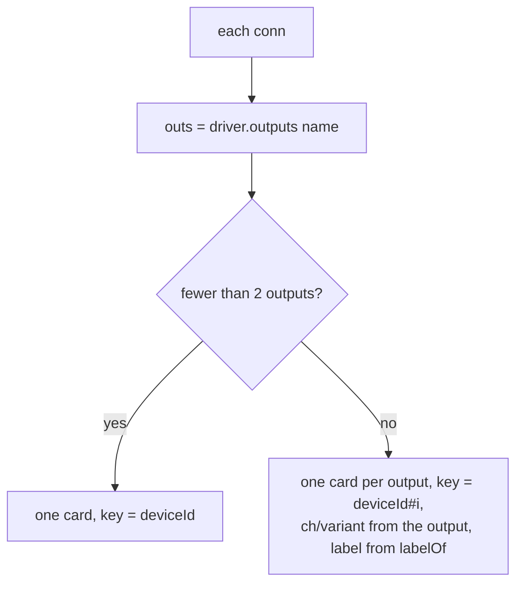
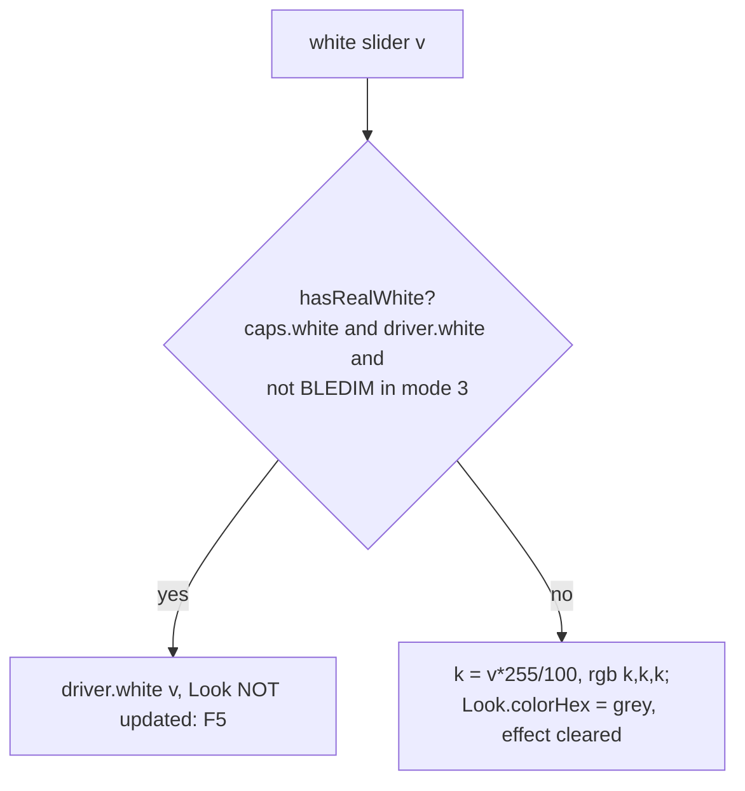
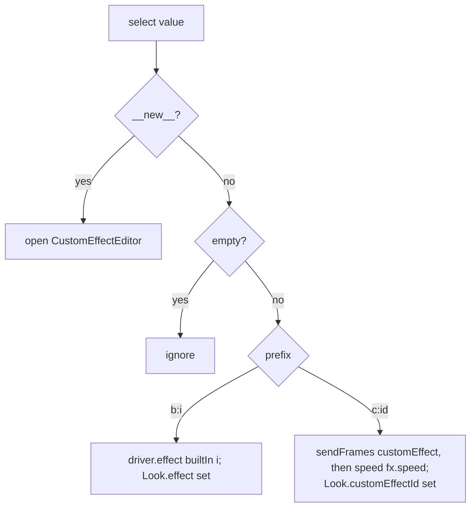
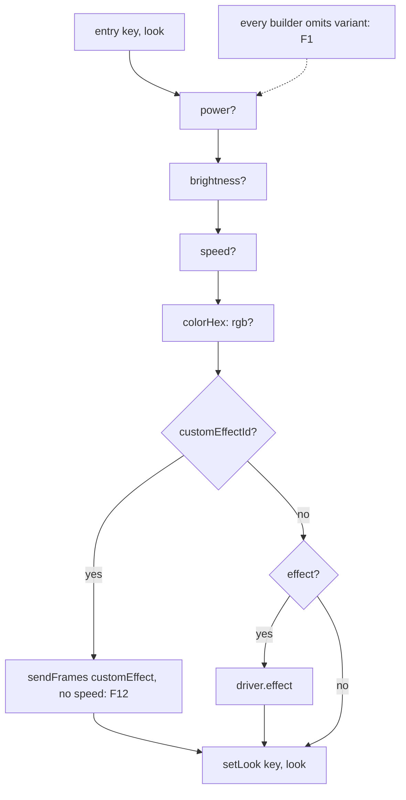

# Flowcharts — ui

## Effects tab: logical endpoints

```mermaid
flowchart TD
  C[each conn] --> O[outs = driver.outputs name]
  O --> N{fewer than 2 outputs?}
  N -- yes --> ONE[one card, key = deviceId]
  N -- no --> MANY[one card per output, key = deviceId#i,<br/>ch/variant from the output, label from labelOf]
```

## DeviceCard: white intent

```mermaid
flowchart TD
  W[white slider v] --> H{hasRealWhite?<br/>caps.white and driver.white and<br/>not BLEDIM in mode 3}
  H -- yes --> DW[driver.white v, Look NOT updated: F5]
  H -- no --> RGB[k = v*255/100, rgb k,k,k;<br/>Look.colorHex = grey, effect cleared]
```

## DeviceCard: choose effect

```mermaid
flowchart TD
  S[select value] --> N{__new__?} -- yes --> ED[open CustomEffectEditor]
  N -- no --> E{empty?} -- yes --> X[ignore]
  E -- no --> K{prefix}
  K -- b:i --> BI[driver.effect builtIn i; Look.effect set]
  K -- c:id --> CU[sendFrames customEffect, then speed fx.speed;<br/>Look.customEffectId set]
```

## Scenes: apply one entry (`applyLook`)

```mermaid
flowchart TD
  A[entry key, look] --> P[power?] --> B[brightness?] --> S[speed?] --> C[colorHex: rgb?]
  C --> CE{customEffectId?}
  CE -- yes --> SF[sendFrames customEffect, no speed: F12]
  CE -- no --> EF{effect?} -- yes --> EE[driver.effect]
  SF --> SL[setLook key, look]
  EE --> SL
  EF -- no --> SL
  NOTE[every builder omits variant: F1] -.-> P
```
